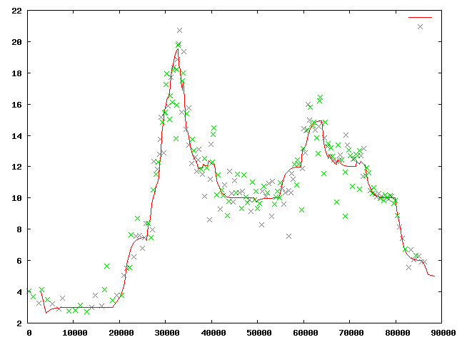
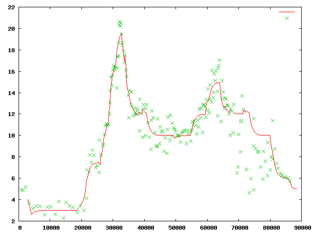
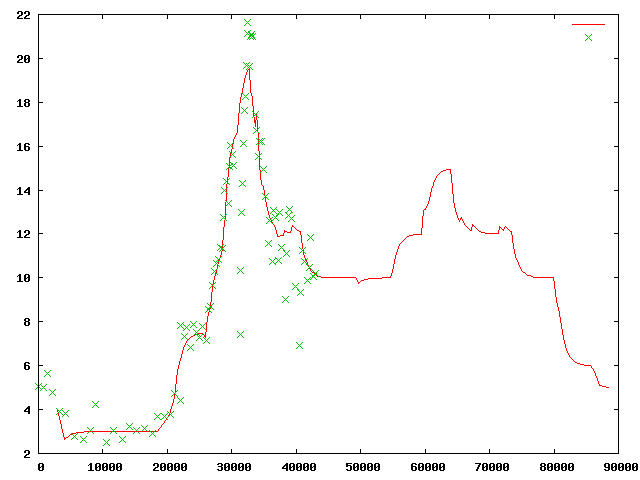

mta
===

Tools to analyze live public data from New York's MTA.

The basic premises is that people arrive at a slowly varying rate, dependent on the time of
day, that these rates are informally but mutually synchronized to the MTAs scheduled rate
of train arrivals,  and that if the rate of train arrival drops below the schedule, people
will pile up on the platform. And be unhappy.

The MTA publishes schedules, along with some other semi-static data, as CSV files on their
developer site.  They also make available some current status data as protobufs on a public
API.  This data is essentially the contents of the countdown clocks in IRT stations, along
with a unique (for the day) identifier of the train's trip from depot to terminus.  While
we know when trains are predicted to arrive, we have no information about the recent past,
so we must infer it by continually polling the predictions and assume that any train that
has dropped off the prediction list for a station has passed it.

Knowing the advertised and actual times at which trains arrive, we can produce a graph
like this:

The X-axis is seconds since midnight.  The Y-axis is the arrival rate in trains per hour,
with a 15-minute exponentially decaying average.  Red is the advertised rate; green x's
are actual measurements.  The above graph is for the 1 line, on the southbound track
at 14th Street and 7th Avenue, on 2013-0-624.

By contrast, here is 2013-06-25.

We can see that on the 25th, trains rain substantially behind schedule during the evening
rush.  That must have sucked.

Here is the data that has accumulated so far today, as I write this.

It appears that there was a bit of a backup during the morning rush hour, but fortunately I
walked to work today.

***

The code here is pretty straightforward.
`snag.py` runs continuously, dumping data into a mongo database.  `rates.py` contains
the smoothing code.

The above images were generated using gnuplot commands like

~~~
gnuplot> plot '< ./mongo2csv localhost:33333:mta sched route_id:1 stop_id:132S service_code:WKD now rate' with lines, '< ./mongo2csv localhost:33333:mta rates route_id:1 stop_id:132S day:2013-08-06 t_day rate'
~~~

using a utility to extract mongo data into column format.

Notes
---

You'll need protobufs:
https://protobuf.googlecode.com/files/protobuf-2.5.0.tar.gz
gzcat | tar -xf -
cd protobuf-2.5.0
./configure
make
cd python
python setup.py build

../protobuf-2.5.0/src/protoc -I./pb --python_out=./pb pb/nyct-subway.proto

svn checkout http://protobuf-json.googlecode.com/svn/trunk/ protobuf-json-read-only
In here: ln -s ../protobuf-2.5.0/python/google

Probably want to run this in a virtualenv.
pip install 

You need a mongo v 2.4 or above
Starting up mongod:
mongod -dbpath . -port 3333 --verbose

Create a db called mta, and in it:

~~~
db.createCollection('sched')
db.createCollection('rates')
db.rates.ensureIndex({day : 1, stop_id : 1, route_id : 1}, {background : true} )
db.sched.ensureIndex({route_id : 1,  service_code : 1, stop_id: 1})
db.etas.ensureIndex({now : 1}, {background : true} )

~~~

Populate static data:

~~~

./sched.py < static/stop_times.txt
 ./csv2mongo mta stops < static/stops.txt

~~~

